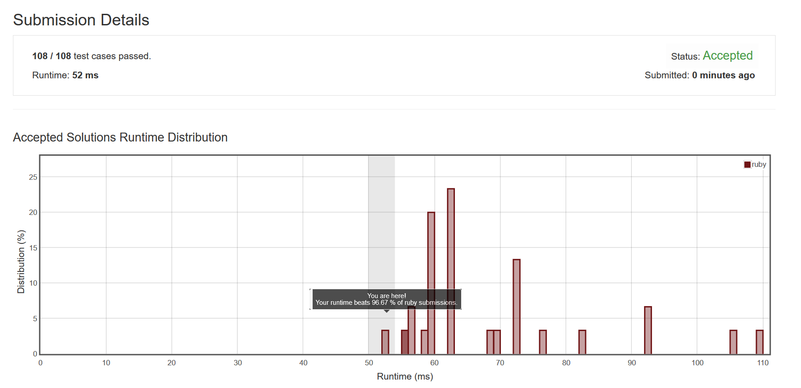

# 66 Plus One

Tag:

- Easy
- Array, Math

Todo List:

- [ ] Java Solution


## Problem Description

输入用数组表示的一个整数，让你加一并处理进位

> Given a non-negative integer represented as a non-empty array of digits, plus one to the integer.
>
> You may assume the integer do not contain any leading zero, except the number 0 itself.
>
> The digits are stored such that the most significant digit is at the head of the list.

## Ideas 

暴力遍历计算就好了

我们先把最低位加一，子问题主要就两种，一种是0-9, 一种是10。如果是10，判断下前面还有没有位数了，有的话本位置0，上1.没有的话就标记一下break出循环，因为前面没有了肯定就是最高位是个9进位成一个1就结束了。**注意**这个题的数组是反着来的，蛋疼

## Ruby Solutions

**收货**: Ruby的unshift比insert到0快得多

### Array Solution

代码如下：

```ruby
# @param {Integer[]} digits
# @return {Integer[]}
def plus_one(digits)
    len = digits.size
    carry_one = false
    digits[-1] += 1
    index = len-1
    digits.reverse_each do |num|
        if num == 10 then
            digits[index] = 0
            if index == 0 then
                carry_one = true
                break
            else
                digits[index-1]+=1
            end
        else
            break
        end
        index -= 1
    end
    digits.unshift(1) if carry_one
    return digits
end
```



## Java Solutions

**注意** 主要有几个坑要注意

+ **数组复制** ：可以用System.arraycopy( src, srcPos, des, desPos, length)

### Array Solution

代码如下

```java
public class Solution {
    public int[] plusOne(int[] digits) {
        boolean carryOne = false;
        int len = digits.length;
        digits[len-1] += 1;
        for(int i = len-1; i >= 0; i--){
            if(10 == digits[i]){
                digits[i] = 0;
                if( 0 != i){
                    digits[i-1]+=1;
                }else{
                    carryOne = true;
                    break;
                }
            }else{
                break;
            }
        }
    
        if(carryOne){
            int [] newDigits = new int[len+1];
            newDigits[0] = 1;
            System.arraycopy(digits, 0, newDigits, 1, len);
            return newDigits;
        }
        return digits;
    }
}
```

