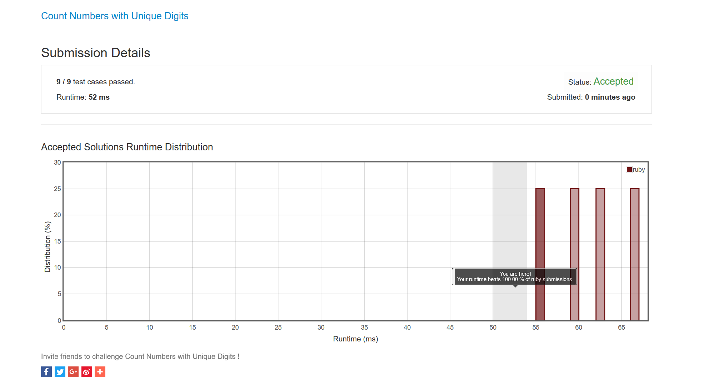

# 256 Paint House

Tag:

- Medium
- Array, Dynamic Programming, Google

Todo List:

- [x] ....


## Problem Description

动态规划系列第六道题，还是看了下题解，主要是思路被打断，其实没什么动态规划的思想。。。就是列出一个通项公式，然后利用前一位的可能数加起来。

>  Given a **non-negative** integer n, count all numbers with unique digits, x, where 0 ≤ x < 10n.
>
>   **Example:**
>  Given n = 2, return 91. (The answer should be the total numbers in the range of 0 ≤ x < 100, excluding `[11,22,33,44,55,66,77,88,99]`)

## Ideas 

这是动态规划系列刷题的第六题，目前进度是读了刘汝佳的书的一小节，读了一些知乎答案，大概能感受到什么是状态和状态转移了(尤其是映射到 图上面)


## Ruby Solutions

### Memoization Solution

暴力解法

```ruby
# @param {Integer} n
# @return {Integer}
def count_numbers_with_unique_digits(n)
    dp = [1,10,91]
    return dp[n] if n <= 2
    3.upto n do |num|
        ans = 9
        9.downto 11-num do |factor|
            ans *= factor
        end
        ans += dp[num-1]
        dp[num] = ans
    end
    return dp[n]
end
```

### 开源节流法

就是省略了memo的数组

```ruby
# @param {Integer} n
# @return {Integer}
def count_numbers_with_unique_digits(n)
    dp = [1,10,91]
    return dp[n] if n <= 2
    ans = 9
    last_ans = 91
    3.upto n do |num|
        ans = 9
        9.downto 11-num do |factor|
            ans *= factor
        end
        ans += last_ans
        last_ans = ans
    end
    ans
end
```

值得高歌一曲？



## Java Solutions

只写迭代版本的了，其他版本都一样

**值得注意的是**： Java int数组初始值为0

### 迭代 + Memoization

Code:

```java
public class Solution {
    public int countNumbersWithUniqueDigits(int n) {
        int []base = new int[]{1,10,91};
        if(n <= 2){
            return base[n];
        }
        int prev_ans = 91;
        int ans = 0;
        for(int i = 3; i<=n; i++){
            ans = 9;
            for(int j = 9; j>=11-i; j--){
                ans *= j;
            }
            ans += prev_ans;
            prev_ans = ans;
        }
        return ans;
    }
}
```

