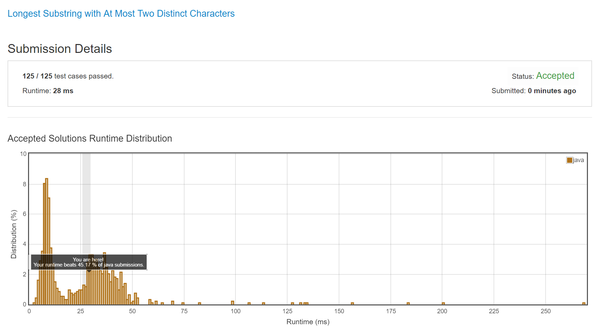

# 159 Longest Substring with At Most Two Distinct Characters

Tag:

- Hard
- String
- Google, Uber

Todos:

- ...
- 尝试用个更快的方法试一下，自己保存一些数据

一句话简介

> ...
>
> 滑动窗口

> The main idea is to maintain a sliding window with 2 unique characters. The key is to store the last occurrence of each character as the value in the hashmap. This way, whenever the size of the hashmap exceeds 2, we can traverse through the map to find the character with the left most index, and remove 1 character from our map. Since the range of characters is constrained, we should be able to find the left most index in constant time.

### 需要注意的是:

*对于字母类问题，一个trick是采用[0,25]作index, 然后判断offset的时候，(ch1+26-ch2) %26*

## Ideas

自己的idea: 取其中一个新建一个List或者Set，遍历剩余数组，先判断长度是否相同，然后判断每一个字符的`差值%26`的绝对值是否相同(用trick代替了)，如果不同就跳过，相同加进List

## Java Solution

### 滑动窗口 sliding window

方法特点：跑的挺快的....也比较直观

```java
class Solution {
    public int lengthOfLongestSubstringTwoDistinct(String s) {
        int left = 0;
        int right = 0;
        int len = s.length();
        int maxlen = 0;
        Map<Character, Integer> indexMap = new HashMap<>();
        // start sliding window
        while(right < len){
            if(indexMap.size() <= 2){   // only two distinct char
                indexMap.put(s.charAt(right), right);
                right += 1;
            }
            // check valid substring
            if(indexMap.size() > 2){
                int leftMost = s.length();
                for(int i : indexMap.values()){
                    leftMost = Math.min(i, leftMost);
                }
                char ch = s.charAt(leftMost);
                // remove the ch from the map
                indexMap.remove(ch);
                // update window
                left = leftMost + 1;
            }
            maxlen = Math.max(maxlen, right-left);
        }
        return maxlen;
    }
}
```



### 方法二：HashMap，转化

未完成

```java

```

