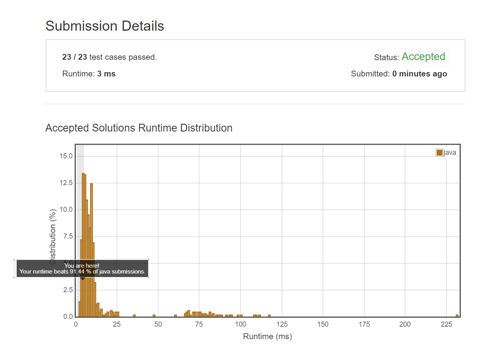

# 249 Group Shifted Strings

Tag:

- Medium
- String
- Google, Uber

Todos:

- ....
- 另一种做法：转成'a'开头，然后用HashMap解决

一句话简介

> ...
>
> 转化的思想，key的思想,可以转化成

## 题目描述

Given a string, we can "shift" each of its letter to its successive letter, for example: `"abc" -> "bcd"`. We can keep "shifting" which forms the sequence:

```Java
"abc" -> "bcd" -> ... -> "xyz"
```

Given a list of strings which contains only lowercase alphabets, group all strings that belong to the same shifting sequence.

For example, given: `["abc", "bcd", "acef", "xyz", "az", "ba", "a", "z"]`, 
A solution is:

```Python
[
  ["abc","bcd","xyz"],
  ["az","ba"],
  ["acef"],
  ["a","z"]
]
```

### 需要注意的是:

*对于字母类问题，一个trick是采用[0,25]作index, 然后判断offset的时候，(ch1+26-ch2) %26*

## Ideas

自己的idea: 取其中一个新建一个List或者Set，遍历剩余数组，先判断长度是否相同，然后判断每一个字符的`差值%26`的绝对值是否相同(用trick代替了)，如果不同就跳过，相同加进List

## Java Solution

### 暴力脑残判断法

方法特点：...土,而且复杂啊,还得单独写一个函数，万一错了就GG了

但是跑的挺快的....

```java
class Solution {
    public List<List<String>> groupStrings(String[] strings) {
        // if strings is empty, we can still return an empty list
        List<List<String>> res = new ArrayList<>();
        int len = strings.length;
        if(len == 0){
            return res;
        }
        
        boolean[] visited = new boolean[len+1];
        // pick one and iterate
        for(int i = 0; i<len; i++){
            if(visited[i]){
                continue;
            }
            visited[i] = true;  // this one and its relavent shifted have been added
            String str = strings[i];
            // init current shifted group list
            List<String> list = new ArrayList<>();
            list.add(str);
            int strLen = str.length();
            // scanning for shifted strings
            for(int j = 0; j < len; j++){
                // skip visited and length dismatch
                if(visited[j] || strings[j].length() != strLen){
                    continue;
                }
                String tmp = strings[j];
                if(isShifted(str,tmp)){
                    visited[j] = true;
                    list.add(tmp);
                }
            }
            res.add(list);
        }
        return res;
    }
    
    private boolean isShifted(String s1, String s2){
        int offset = (s1.charAt(0)+26-s2.charAt(0))%26; // initialized with index zero
        for(int i = 1; i < s1.length(); i++){
            char ch1 = s1.charAt(i);
            char ch2 = s2.charAt(i);
            int tmpOffset= (ch1+26-ch2)%26;
            if(tmpOffset != offset){
                return false;
            }
        }
        return true;
    }
}
```



### 方法二：HashMap，转化

未完成

```java

```

