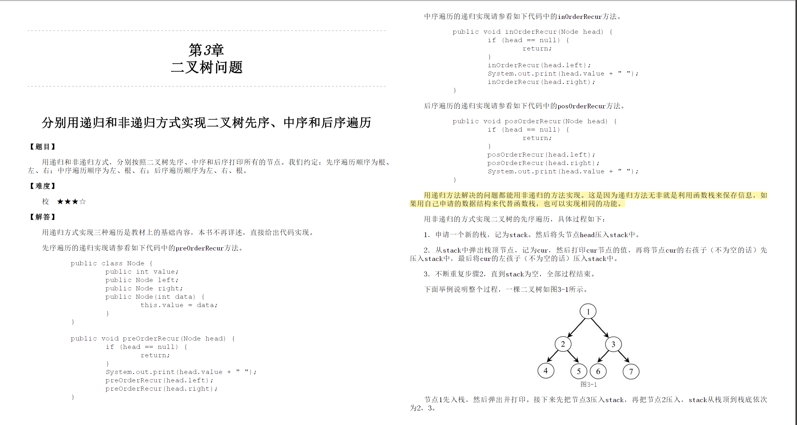
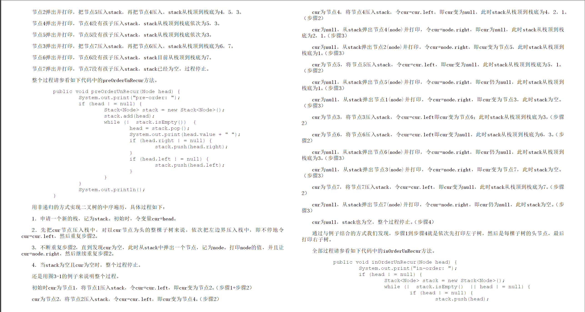
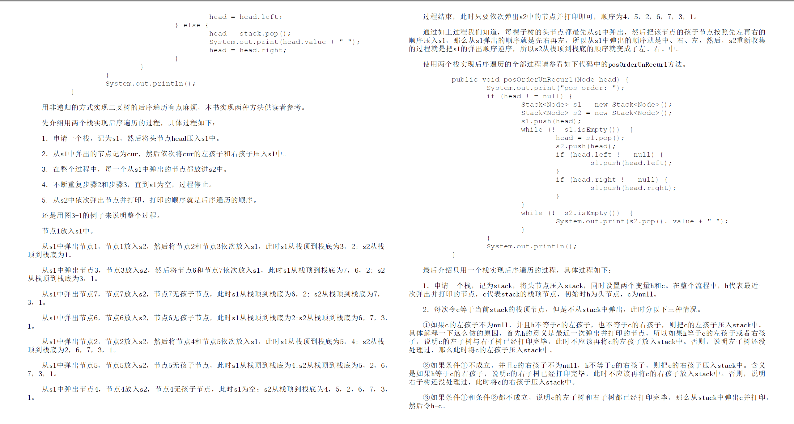
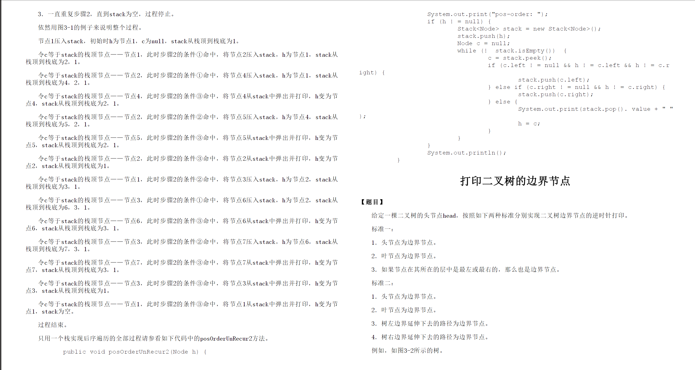

# Introduction

Todos:

- 后序遍历
- 中序遍历相关题
- 先序遍历相关题
- 层序遍历
- 后序遍历相关题

二叉树的遍历包括前序、中序、后序、层序，注意这里前面三个指的都是遍历根的时机

前序是先根遍历，后序是后根遍历，以此类推


# Common Traversal

参考自[左程云的书](https://book.douban.com/subject/26638586/)

## Recursive 

递归可以说非常非常直观了...大二上水平...

### Pre-Order 

[leetcode 144](https://leetcode.com/problems/binary-tree-preorder-traversal/description/)

先处理node，再处理子节点

```java
public void preOrderRecursive(TreeNode node){
    if(null == node){
        return;
    }
    res.add(node.val); // do some opertation
    preOrderRecursive(node.left);
    preOrderRecursive(node.right);
}
```

### In-Order

### Post-Order

## Iteritive

### Pre-Order

思路：用栈来模拟递归堆栈的情况，注意这里要判断根是否为空

```java
public void preOrderIter(TreeNode root){
    Deque<TreeNode> stack = new ArrayDeque<>();
    // enter-stack the root
    stack.push(root);
    TreeNode cur  = null;
    while(stack.size() != 0){
        cur = stack.pop();
        res.add(cur.val);
        if(cur.right != null){
            stack.push(cur.right);
        }
        if(cur.left != null){
            stack.push(cur.left);
        }
    }
}
```

### In-Order

**值得学习**: 记住这个while的写法

```java
public void inOrderIterative(TreeNode root, List<Integer> list){
    // construct stack
    if(root == null){
        return;
    }
    Deque<TreeNode> stack = new ArrayDeque<>();
    TreeNode cur = root;
    while(stack.size() != 0 || cur != null){
        // push all left-most nodes into stack
        if(cur != null){
            stack.push(cur);
            cur = cur.left;
        }else{  // now cur is the leftmost child, deal with it and en-stack its right child
            cur = stack.pop();
            list.add(cur.val);
            cur = cur.right;
        }
    }

}
```

循环里也可以这么写:

```java
    while(stack.size() != 0 || cur != null){
        // push all left-most nodes into stack
        while(cur != null){
            stack.push(cur);
            cur = cur.left;
        }
        // now cur is the leftmost child, deal with it and en-stack its right child
        cur = stack.pop();
        list.add(cur.val);
        cur = cur.right;

    }
```

### Post-Order


# Level-order Traversal


# Reference




